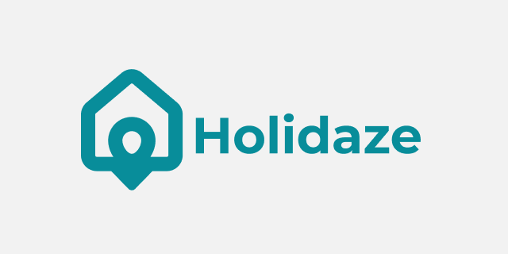

# [](https://jnet-holidaze.netlify.app/)

Holidaze is a React-based booking website designed to help users find and book venues for their stays. It features user authentication, venue creation and management, personal profiles, and interactive booking calendars.

---

## Features

- **Home Page**: Browse and view all available venues.
- **Login Modal**: Login or register to access personalized features.
- **Profile Page**: Accessible only to logged-in users; view and edit your profile, personal bookings, and your venues.
- **Create Venue Page**: Allows venue owners to create new venues.
- **Venue Detail Page**: View detailed info about a specific venue, check availability with a calendar that greys out booked dates, and book your stay.
- **Booking Management**: Logged-in users can view their bookings; venue owners can see bookings made for their venues.
- **Success Page**: Confirmation page displaying details after a successful booking.
- **About Page**: Information about Holidaze.

---

## Tech Stack & Dependencies

- **React 18**: UI framework for building interactive components.
- **Vite**: Build tool and development server.
- **Tailwind CSS**: Utility-first CSS framework for styling.
- **React Router DOM**: Client-side routing.
- **React Helmet Async**: Manage document head and meta tags.
- **React Date Range**: Booking calendar component.
- **React Leaflet & Leaflet**: Map integration for venue locations.
- **Zustand**: State management.
- **React Toastify**: Notifications and alerts.
- **Date-fns**: Date utility functions.
- **Lodash.debounce**: Debouncing for performance optimizations.

---

## Getting Started

### Prerequisites

- Node.js (v18 or higher recommended)
- npm

### Installation

1. Clone the repo:

   ```bash
   git clone https://github.com/JNettli/holidaze.git
   cd holidaze
   ```

2. Install dependencies:

   ```
   npm install
   ```

3. Run the development server:

   ```
   npm run dev
   ```

4. Open localhost to view the app in your browser!

---

## Build for Production
To build the optimized production bundle:

```
npm run build
```

## To preview the production build locally:

```
npm run preview
```

## License
This project is licensed under the MIT License.

_Built with React, Vite and Tailwind CSS._
